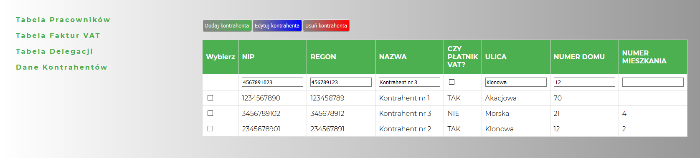

# Panel zarządzania
## Aplikacja internetowa emulująca panel zarządzania firmą, powstała z wykorzystaniem technologii PHP, HTML, CSS, JavaScript, mySQL
Podstrony aplikacji zawierają m.in.: 
  * tabelę z możliwością zmiany kolorów
  * interaktywną tabelę JS, liczącą kwoty netto i brutto
  * tabelę pobraną z bazy danych z możliwością edycji, dodania i usuwania rekordów

## Wymagania
* PHP
* mySQL

## Projekt
<a href="http://panel-zarzadzania.j.pl">Link do projektu</a>

## Zdjęcia

## Sposób użycia
W tabeli pracowników można zmienić kolor wierszy parzystych i nieparzystych tabeli oraz kolor czcionki. W tabeli faktur VAT są obliczane na bieżąco wartości netto i brutto w zależności od wybranej ilości i VAT. Po wciśnięciu przycisku wiersze, w których kwota netto wynosi powyżej 1000 są kolorowane na zielono. Tabela delegacji przedstawia dane pobrane z bazy danych. W zakładce dane kontrahentów można dodawać, edytować i usuwać kontahentów, zmiany są zapisywane w bazie danych. 
* Aby dodać kontrahenta należy wpisać dane w pierwszym wierszu tabeli, następnie kliknąć przycisk 'dodaj kontrahenta'. 
* W celu edycji danych należy zaznaczyć checkbox, przy rekordzie, który chcemy edytować, dane zostaną wpisane do pierwszego wiersza tabeli, po edycji danych należy wcisnąć przycisk 'edytuj kontrahenta'. 
* Aby usunąć kontrahenta nalezy wybrać checkbox i wcisnąć przycisk 'usuń kontrahenta', zostanie usunięty kontrahent o wybranym numerze NIP, jeśli istnieje kilka rekordów o tym samym numerze NIP, wszystkie zostaną usunięte.
